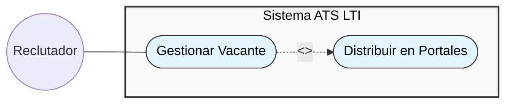
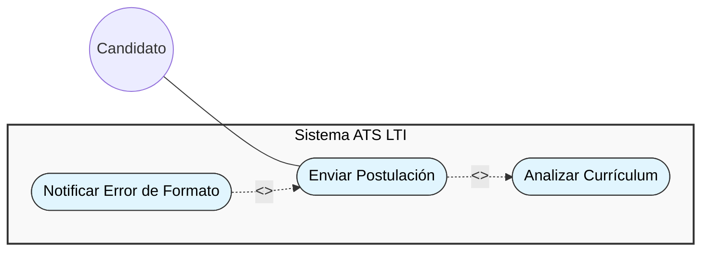
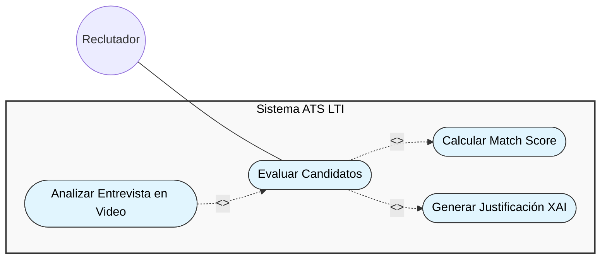
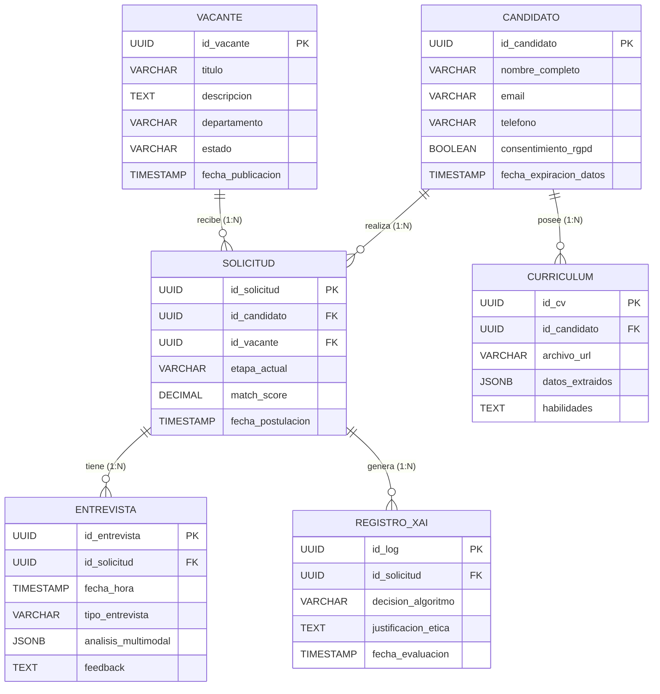
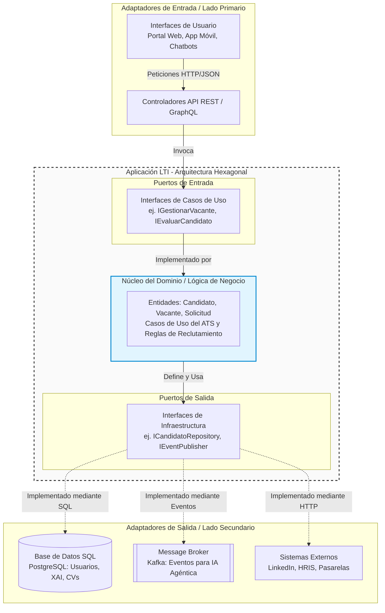
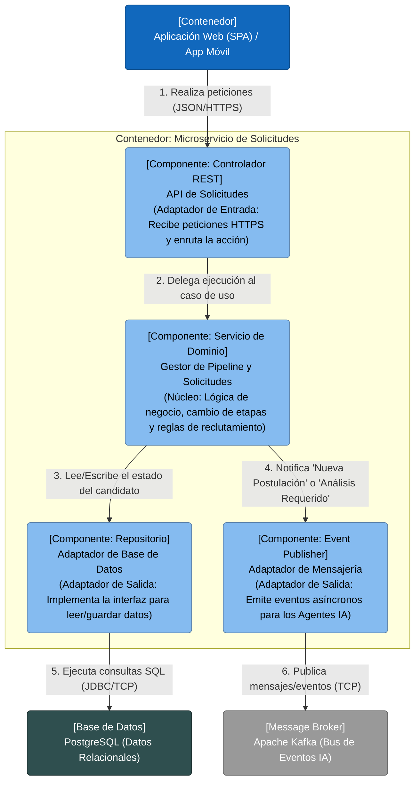

# Sistema LTI (Descripción del software)

## Descripción del software

**LTI** es un Sistema de Seguimiento de Candidatos (ATS) de nueva generación impulsado por Inteligencia Artificial Agéntica y diseñado para centralizar, automatizar y transformar estratégicamente el proceso de reclutamiento de principio a fin. En lugar de ser un simple repositorio de currículums, LTI actúa como un ecosistema colaborativo que conecta a las empresas con el mejor talento a través de flujos de trabajo autónomos, garantizando un proceso eficiente, ético y centrado en mejorar radicalmente la experiencia tanto del candidato como del reclutador.

### Valor Añadido

*   **Inteligencia Artificial Explicable (XAI) y Reclutamiento Ético:** A diferencia de los sistemas tradicionales que operan como una "caja negra", LTI integra XAI para proporcionar total transparencia sobre por qué un algoritmo toma una decisión o recomienda un perfil. Esto permite auditar los procesos, mitigar sesgos algorítmicos discriminatorios y fomentar una contratación verdaderamente inclusiva, incluso para personas con discapacidad.
*   **Análisis Multimodal de Sentimientos en Video:** LTI va más allá del análisis de texto. Incorpora tecnología capaz de procesar señales faciales, microexpresiones, tono de voz y respuestas emocionales en las entrevistas por video, evaluando las habilidades blandas y la compatibilidad cultural con un 92% de precisión.
*   **Gobernanza y Privacidad desde el Diseño (Cumplimiento RGPD/DPDP):** Resuelve de raíz uno de los mayores dolores de cabeza de los equipos legales y de RR. HH. LTI automatiza el ciclo de vida del consentimiento del candidato, genera alertas en tiempo real sobre la caducidad de los datos, gestiona el borrado automático de perfiles inactivos y ofrece portales para que los candidatos ejerzan sus derechos de privacidad fácilmente.

### Ventajas Competitivas

*   **Automatización Avanzada mediante Equipos de Agentes IA:** LTI no espera instrucciones paso a paso. Utiliza un sistema multiagente donde diferentes IAs especializadas colaboran entre sí de forma autónoma. Un agente analiza el currículum, otro evalúa habilidades técnicas, otro redacta comunicaciones personalizadas y otro programa la entrevista en el calendario, ejecutando flujos de trabajo enteros en minutos.
*   **Enfoque "Mobile-First" y Atracción Omnicanal:** LTI permite a los equipos de selección gestionar todo el proceso, evaluar y comunicarse desde cualquier lugar mediante una aplicación móvil robusta. Para el candidato, ofrece interacción moderna con opciones como el *text-to-apply* (postulación por SMS o WhatsApp) y chatbots inteligentes. Además, su herramienta de **multiposting** garantiza la publicación automática de vacantes en decenas de portales y redes sociales con un solo clic.
*   **Fusión de ATS con CRM de Reclutamiento:** LTI no se limita a gestionar a los postulantes que buscan empleo activamente. Integra funciones de Gestión de Relaciones con Candidatos (CRM) para construir, segmentar y nutrir *reservas de talento (talent pools)*, interactuando de forma proactiva con perfiles valiosos para futuras necesidades de la empresa.
*   **Analítica Predictiva y Retorno de Inversión (ROI):** LTI cruza el historial de los candidatos y métricas de desempeño para aplicar modelos predictivos que pronostican el éxito y la retención del talento a largo plazo. Ofrece cuadros de mando avanzados que permiten a los reclutadores medir con precisión el coste por contratación, el tiempo de cobertura y la satisfacción del gerente de contratación, áreas donde las plataformas convencionales suelen fallar.

---

## Documento de Requisitos del Producto (PRD)
**Nombre del Producto:** LTI (Ecosistema ATS/CRM impulsado por IA Agéntica)
**Documento:** PRD - Versión 1.0
**Estado:** En revisión
**Público Objetivo:** Equipos de Ingeniería, Diseño (UX/UI), Marketing B2B y Stakeholders/Inversores.

## 1. Resumen Ejecutivo (Executive Summary)
Durante años, los sistemas de seguimiento de candidatos (ATS) fueron vistos únicamente como repositorios de currículums. Hoy, las empresas se enfrentan a un gran volumen de solicitudes y procesos lentos. LTI es un sistema ATS y CRM de nueva generación que utiliza **Inteligencia Artificial Agéntica** para automatizar flujos de trabajo completos en el reclutamiento. Su diferenciador principal (Ventaja Injusta) radica en la integración de **IA Explicable (XAI)** para garantizar un reclutamiento ético sin "cajas negras", **análisis multimodal en video** para habilidades blandas, y el **cumplimiento nativo del RGPD** para la gestión de la privacidad de los datos.

## 2. Definición del Problema
Los departamentos de Recursos Humanos de empresas medianas y grandes sufren de tres "dolores" principales:
1. **Ineficiencia y carga administrativa:** La clasificación manual de currículums y la introducción doble de datos entre el ATS y los sistemas HRIS consumen tiempo valioso y aumentan el costo de contratación.
2. **Falta de transparencia y sesgos algorítmicos:** Los sistemas de IA tradicionales operan como una "caja negra". Los reclutadores no pueden explicar por qué un algoritmo descarta a un candidato, exponiendo a la empresa a riesgos legales y perpetuando sesgos discriminatorios.
3. **Riesgos de Privacidad:** Con regulaciones estrictas como el RGPD, gestionar el ciclo de vida del consentimiento, retener indefinidamente datos personales de forma descentralizada y carecer de procesos automatizados de borrado supone un alto riesgo legal y de pérdida de reputación.

## 3. Público Objetivo (User Personas)
* **Reclutador / Gerente de Adquisición de Talento:** Necesita una herramienta centralizada que filtre a los candidatos idóneos rápidamente, le asista de manera proactiva programando entrevistas y se comunique con ellos para mejorar la experiencia.
* **Candidato:** Exige un proceso de postulación rápido (Mobile-First, "text-to-apply"), comunicaciones claras sobre su estado en el proceso y garantía de que sus datos están seguros.
* **Director de RR. HH. / Responsable Legal (DPO):** Busca paneles de control predictivos sobre el costo de contratación y requiere auditorías transparentes (XAI) e informes de cumplimiento de privacidad de datos (RGPD).

## 4. Propuesta de Valor
Actuar como una "agencia de reclutamiento virtual 24/7" operando dentro de la empresa. LTI potencia el criterio experto humano mediante un ecosistema automatizado, asegurando un proceso de contratación más ágil, sin sesgos y que cumple legalmente desde el diseño. 

## 5. Requisitos Funcionales (Core Features)

### 5.1 Motor de Análisis Semántico y Matching (NLP)
* **Descripción:** Un agente de IA que extrae datos de los currículums (parsing) y realiza coincidencias semánticas con las descripciones del puesto (ej. entender que "Machine Learning" y "ML" son lo mismo).
* **Requisito:** Debe mapear habilidades hacia una taxonomía estructurada y generar un "Match Score".
* **Criterio de Aceptación:** El sistema debe procesar PDFs y DOCX sin importar el diseño y mostrar un ranking clasificado de los perfiles más compatibles.

### 5.2 Análisis Multimodal en Video (Sentimientos y Emociones)
* **Descripción:** Un agente visual/auditivo capaz de analizar entrevistas grabadas o en vivo.
* **Requisito:** La IA debe detectar expresiones faciales, tono de voz, ritmo y nivel de confianza, generando un desglose emocional sobre las habilidades blandas del candidato.
* **Criterio de Aceptación:** Debe lograr una precisión superior al 90% en la clasificación de sentimientos y operar en múltiples idiomas (mínimo español e inglés).

### 5.3 Módulo de Inteligencia Artificial Explicable (XAI)
* **Descripción:** Un motor de auditoría ética que traduce las decisiones de la IA a lenguaje humano.
* **Requisito:** Cada vez que el sistema asigna una puntuación a un candidato o lo descarta, el motor XAI debe registrar en una base de datos relacional (PostgreSQL) las variables exactas que justifican dicha decisión.
* **Criterio de Aceptación:** Un panel de reclutador debe mostrar un botón "Ver justificación de IA" en el perfil de cada candidato, previniendo sesgos.

### 5.4 Gobernanza de Datos y Cumplimiento RGPD
* **Descripción:** Gestión automática de la privacidad del talento.
* **Requisito:** Módulo de caducidad de datos (Ej. purga automática de currículums y videos inactivos después de 2 años). Gestión de derechos de los candidatos (acceso, rectificación, borrado).
* **Criterio de Aceptación:** Los candidatos deben poder revocar su consentimiento desde un portal de autoservicio y los reclutadores deben recibir alertas antes del borrado de datos.

### 5.5 Omnicanalidad y Multiposting
* **Descripción:** Publicación de ofertas en decenas de portales y redes sociales con un solo clic para llegar a audiencias activas y pasivas (CRM).
* **Requisito:** Conexiones vía API a LinkedIn, Indeed, Glassdoor, etc.
* **Criterio de Aceptación:** Desde el creador de vacantes, el usuario debe poder publicar la misma oferta en más de 5 plataformas simultáneamente.

### 5.6 Integración Continua de RR. HH. (Onboarding)
* **Descripción:** Flujo fluido de datos hacia los sistemas centrales de RR. HH. tras la contratación.
* **Requisito:** Conectores (API) hacia sistemas HRIS o herramientas de nómina.
* **Criterio de Aceptación:** Al marcar un candidato como "Contratado", su información debe migrar instantáneamente al HRIS, desencadenando los procesos de alta de TI y bienvenida.

## 6. Requisitos No Funcionales
* **Seguridad y Encriptación:** Cifrado de extremo a extremo para los datos personales y videos almacenados (ej. AWS S3).
* **Escalabilidad:** Arquitectura basada en microservicios en la nube, optimizada mediante flujos CI/CD para admitir actualizaciones continuas sin tiempo de inactividad.
* **Movilidad:** El sistema debe ser "Mobile-First", con una App Móvil responsiva para que los reclutadores tomen decisiones *on-the-go*.

## 7. Métricas de Éxito (KPIs)
Para validar la aceptación del producto y su viabilidad, monitorizaremos:
1. **Reducción del Time-to-Hire:** Disminución en el tiempo desde la publicación de la vacante hasta la firma de la oferta (objetivo: -30% vs procesos manuales).
2. **Costo por Contratación (Cost-per-hire):** Medir el ahorro por automatización administrativa.
3. **Tasa de Adquisición B2B:** Conversiones de demostraciones (Demos) a clientes con licencias SaaS de pago (Tiers).
4. **Candidate Experience Score (NPS):** Nivel de satisfacción de los candidatos respecto a la fluidez, comunicación y transparencia del proceso automatizado.

## 8. Fuera de Alcance (Out of Scope - Versión 1.0)
* Generación automatizada de contratos de trabajo dinámicos con firma digital nativa (Se integrará mediante software de terceros tipo DocuSign en futuras iteraciones).
* Módulo de contabilidad/gestión de nóminas propio (LTI delegará esto al sistema HRIS vía API).

---

## Casos de Uso (UML)

### 1. Gestionar y Publicar Vacantes (con Multiposting)
Este caso de uso es fundamental para que la empresa anuncie la vacante y atraiga al talento. 

*   **Actor principal:** Reclutador.
*   **Descripción:** El reclutador interactúa con el sistema para crear y publicar una oferta de empleo. 
*   **Buenas prácticas UML:** La acción principal incluye de forma obligatoria la distribución de la vacante. Por ello, se aplica una relación `<<include>>` hacia el caso de uso "Distribuir en Portales" (Multiposting), garantizando la automatización para maximizar la visibilidad de la oferta en diferentes plataformas.

### 2. Enviar Postulación de Empleo (con Parsing)
El sistema debe recibir los datos del candidato y transformar documentos como el currículum en información estructurada en la base de datos.

*   **Actor principal:** Candidato.
*   **Descripción:** El candidato se postula a una vacante enviando su información y archivos.
*   **Buenas prácticas UML:** 
    *   Se utiliza `<<include>>` hacia "Analizar Currículum", ya que el sistema siempre debe escanear el documento para comparar el perfil con las palabras clave y habilidades de la vacante.
    *   Se utiliza una relación `<<extend>>` para la notificación de errores. Según UML, esta relación (cuya flecha apunta desde el caso de extensión hacia el caso base) solo se inserta en el flujo si ocurre una condición excepcional, como subir un archivo con un formato ilegible o corrupto.

### 3. Evaluar y Clasificar Candidatos (con IA Ética)
Este es el motor de Inteligencia Artificial Agéntica de LTI, donde se aplica el emparejamiento inteligente de perfiles y se mitigan los sesgos algorítmicos.

*   **Actor principal:** Reclutador.
*   **Descripción:** El reclutador revisa la lista de candidatos que el sistema ha clasificado de manera automática.
*   **Buenas prácticas UML:** 
    *   El caso base (`Evaluar Candidatos`) delega la lógica interna obligatoria mediante `<<include>>` hacia "Calcular Match Score".
    *   Se usa otra inclusión obligatoria (`<<include>>`) hacia "Generar Justificación XAI" para asegurar que cada puntuación algorítmica cuente con un registro transparente y ético, evitando modelos de caja negra.
    *   Se incorpora una relación de extensión (`<<extend>>`) para "Analizar Entrevista en Video". Esto modela un comportamiento adicional que realza el caso base, pero que solo se activa bajo la condición de que el flujo de reclutamiento incluya una entrevista grabada.

---

## Diccionario de Datos

### Entidades Fuertes
Son aquellas que no dependen de ninguna otra para existir en el sistema. Tienen su propia Clave Primaria (PK) unívoca.

**CANDIDATO** (Usuarios postulantes)
*   `id_candidato` (UUID) - **PK**
*   `nombre_completo` (VARCHAR 150) - NOT NULL
*   `email` (VARCHAR 150) - UNIQUE, NOT NULL
*   `telefono` (VARCHAR 20)
*   `consentimiento_rgpd` (BOOLEAN) - DEFAULT FALSE
*   `fecha_expiracion_datos` (TIMESTAMP)

**VACANTE** (Ofertas de empleo de la empresa)
*   `id_vacante` (UUID) - **PK**
*   `titulo` (VARCHAR 100) - NOT NULL
*   `descripcion` (TEXT) - NOT NULL
*   `departamento` (VARCHAR 100)
*   `estado` (VARCHAR 20)
*   `fecha_publicacion` (TIMESTAMP)

### Entidades Asociativas
Como un candidato puede aplicar a muchas vacantes y una vacante recibe a muchos candidatos, tenemos una relación original Muchos a Muchos (N:M). Para cumplir con el modelo relacional, rompemos esta relación N:M creando una entidad asociativa o tabla intermedia.

**SOLICITUD** (La postulación concreta a un puesto)
*   `id_solicitud` (UUID) - **PK**
*   `id_candidato` (UUID) - **FK** (Ref: Candidato)
*   `id_vacante` (UUID) - **FK** (Ref: Vacante)
*   `etapa_actual` (VARCHAR 50)
*   `match_score` (DECIMAL 5,2) - (Puntuación de IA)
*   `fecha_postulacion` (TIMESTAMP)

### Entidades Débiles (Dependencia de Existencia)
Son entidades que carecen de significado si se elimina su entidad padre o fuerte. Si se borra una *Solicitud*, por ejemplo, se deben borrar en cascada sus entrevistas y auditorías XAI. 

**CURRICULUM** (Documento y datos parseados)
*   `id_cv` (UUID) - **PK**
*   `id_candidato` (UUID) - **FK** (Ref: Candidato)
*   `archivo_url` (VARCHAR 255)
*   `datos_extraidos` (JSONB) - (Para el parsing estructurado)
*   `habilidades` (TEXT)

**ENTREVISTA** (Evaluación multimodal)
*   `id_entrevista` (UUID) - **PK**
*   `id_solicitud` (UUID) - **FK** (Ref: Solicitud)
*   `fecha_hora` (TIMESTAMP)
*   `tipo_entrevista` (VARCHAR 50)
*   `analisis_multimodal` (JSONB)
*   `feedback` (TEXT)

**REGISTRO_XAI** (Auditoría algorítmica y ética)
*   `id_log` (UUID) - **PK**
*   `id_solicitud` (UUID) - **FK** (Ref: Solicitud)
*   `decision_algoritmo` (VARCHAR 100)
*   `justificacion_etica` (TEXT) - NOT NULL
*   `fecha_evaluacion` (TIMESTAMP)

---

### 2. Diagrama Entidad-Relación (Notación Crow's Foot)

Como DBA, utilizaré la **notación de Pata de Gallo (Crow's Foot)**, estándar en la industria para modelado visual de cardinalidades.

---
## Arquitectura

### Diagrama de Arquitectura Hexagonal de Alto Nivel.

---

### Explicación del Diseño del Sistema LTI

La arquitectura hexagonal se divide en tres áreas clave que se comunican de afuera hacia adentro (Inversión de Control), garantizando que las dependencias siempre apunten hacia el núcleo del negocio.

#### 1. El Núcleo de la Aplicación (El Centro del Hexágono)
Es el corazón de LTI. Aquí residen las **Entidades** (como `Candidato`, `Solicitud` o `Vacante`) y los **Casos de Uso** puros del negocio. 
*   **Regla de oro:** Este núcleo está completamente aislado. No contiene código SQL, no sabe si responde a peticiones HTTP de la web o si se usa Kafka o RabbitMQ. Es pura lógica de reclutamiento.

#### 2. Los Puertos (Las Interfaces)
Los puertos actúan como un contrato que define cómo el núcleo interactúa con el mundo exterior.
*   **Puertos de Entrada (Lado Primario):** Definen lo que el sistema *puede hacer*. Por ejemplo, el puerto `IPublicarVacante` expone la funcionalidad para que la interfaz de usuario la invoque, sin importar si viene de la App Móvil o de la Web.
*   **Puertos de Salida (Lado Secundario):** Definen lo que el sistema *necesita del exterior*. Si la lógica de negocio necesita guardar un currículum, usa el puerto de salida `ICurriculumRepository`. Al núcleo no le importa cómo se guarda, solo exige que se cumpla ese contrato.

#### 3. Los Adaptadores (La Infraestructura Externa)
Son las implementaciones técnicas específicas que se "enchufan" a los puertos para comunicarse con el núcleo.
*   **Adaptadores de Entrada (Driving Adapters):** Traducen las peticiones externas al formato que entiende el dominio. En nuestro caso, los **Controladores REST** toman el JSON que envía el reclutador desde su navegador y lo convierten en llamadas al puerto de entrada.
*   **Adaptadores de Salida (Driven Adapters):** Traducen los requerimientos del dominio hacia las herramientas externas. 
    *   Un adaptador tomará los datos del candidato y los guardará ejecutando código SQL en **PostgreSQL** (aprovechando sus capacidades JSONB para los CVs parseados y tablas relacionales para la auditoría ética XAI).
    *   Otro adaptador publicará un evento en **Kafka** para avisarle de manera asíncrona a los Agentes de Inteligencia Artificial que deben analizar un video o un currículum.

### Ventajas de este enfoque para LTI
1. **Desacoplamiento Tecnológico Real:** Si mañana la empresa decide migrar la base de datos de currículums de PostgreSQL a una base de datos documental (como MongoDB), los ingenieros **solo tendrán que escribir un nuevo adaptador**. La lógica central de reclutamiento permanecerá intacta.
2. **Facilidad de Pruebas (Testing):** La lógica de negocio y los cálculos del *Match Score* se pueden probar de manera aislada (pruebas unitarias) inyectando adaptadores falsos (*mocks*), sin necesidad de levantar pesadas bases de datos o servicios en la nube.
3. **Escalabilidad y Microservicios:** Este patrón es la base ideal para sistemas distribuidos y microservicios. Nos permite que el Motor de Inteligencia Artificial Agéntica evolucione a su propio ritmo sin romper la estabilidad del ATS principal.

---

## Nivel 3 del Modelo C4 (Diagrama de Componentes)

*Nota: El Diagrama de Arquitectura Hexagonal del apartado anterior ilustra efectivamente el Nivel 2 (Contenedores) del sistema. A continuación, haremos un zoom al interior del contenedor principal mediante el Nivel 3 del Modelo C4.*

El contenedor más crítico para el flujo de trabajo del reclutador es el **Microservicio de Gestión de Solicitudes (Pipeline)**. Este contenedor actúa como el corazón del ATS, recibiendo a los candidatos, gestionando su avance en las etapas de contratación y delegando el análisis pesado al ecosistema de IA.

### Análisis de los Componentes Internos (Nivel 3)

Al inspeccionar el interior del **Microservicio de Solicitudes**, identificamos cuatro componentes clave que interactúan para procesar el reclutamiento:

1.  **Componente Controlador REST (Adaptador de Entrada):**
    Es la puerta de entrada técnica. Su única responsabilidad es recibir el JSON de la Aplicación Web (por ejemplo, cuando el reclutador arrastra a un candidato a la columna de "Entrevista" en su tablero Kanban), validar que la estructura de la petición HTTP sea correcta, verificar los tokens de seguridad y traducir esa petición al lenguaje que entiende el núcleo del negocio.
2.  **Componente Gestor de Pipeline (Núcleo / Caso de Uso):**
    Este componente contiene la **lógica de negocio pura**. No sabe nada de bases de datos ni de APIs. Contiene las reglas del ATS: verifica si el candidato cumple con los requisitos mínimos de la etapa, calcula su avance y determina qué debe ocurrir a continuación. Si el candidato acaba de postularse, este componente dictamina que se debe guardar en la base de datos y que se debe solicitar a la IA que analice su currículum.
3.  **Componente Repositorio (Adaptador de Salida SQL):**
    Cuando el Caso de Uso decide que hay que guardar el nuevo estado de la solicitud, llama a una interfaz genérica. Este componente toma esos datos, construye la consulta SQL exacta y la envía al contenedor de base de datos **PostgreSQL**. Esta separación asegura que el diseño permanezca agnóstico a la tecnología de la base de datos subyacente.
4.  **Componente Publicador de Eventos (Adaptador de Mensajería):**
    Es vital para la arquitectura orientada a eventos. Dado que el análisis de IA de un currículum o de un video toma tiempo, el núcleo del ATS no se queda esperando. En su lugar, utiliza este componente para publicar un evento asíncrono en **Apache Kafka** (ej. `"AnalizarCV_Candidato_123"`). Los Agentes de IA (NLP o Video) consumen este mensaje en segundo plano, hacen su trabajo y luego actualizan el perfil del candidato, permitiendo que el sistema LTI siga siendo rápido y escalable.
